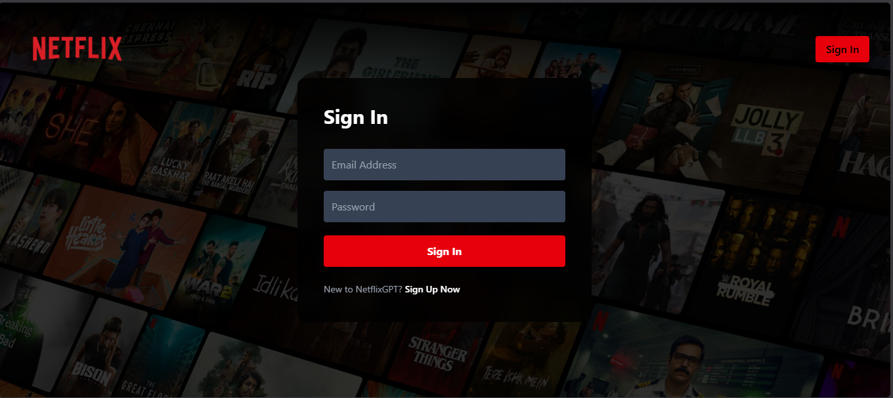
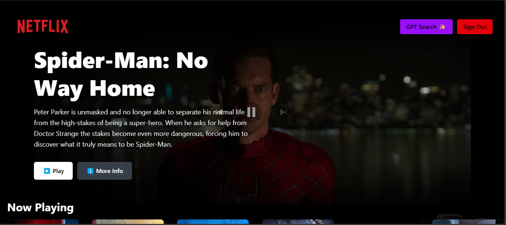
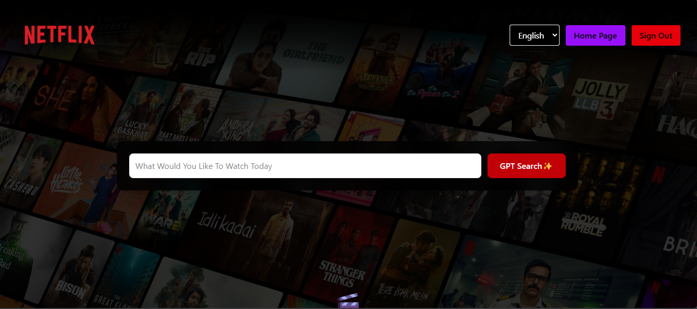

# 🎬 NetflixGPT


An AI-powered Netflix Clone built with **React**, **Redux Toolkit**, **Firebase Authentication**, **Gemini AI**, and **TMDB API**.

Users can browse trending movies, watch trailers, and receive AI-powered movie recommendations using natural language prompts.

---

## 🌐 Live Demo

🔗 **https://netflixgpt-fdca2.web.app**

---

## ✨ Features

- 🔐 Firebase Authentication (Sign Up / Sign In / Sign Out)
- 🛡️ Protected & Public Routes
- 🎥 Browse Now Playing Movies
- 🔥 Popular Movies
- ⭐ Top Rated Movies
- 🎬 Upcoming Movies
- ▶️ Auto-playing Movie Trailers
- 🤖 AI Movie Recommendations using Gemini AI
- 🎞️ TMDB API Integration
- 🌍 Multi-language Support
- 📱 Fully Responsive Design
- ⏳ AI Loading State
- 📭 Empty State for AI Search
- ⚡ Fast Performance with Vite

---

## 🛠️ Tech Stack

### Frontend

- React.js
- Redux Toolkit
- React Router DOM
- Tailwind CSS

### Backend / Services

- Firebase Authentication
- Firebase Hosting

### APIs

- Gemini AI
- TMDB API

### Build Tool

- Vite

---

# 📸 Screenshots

## Login Page



---

## Browse Page



---

## GPT Search



---

## 📂 Folder Structure

```bash
src
│
├── app
│   └── slices
│
├── components
│
├── hooks
│
├── utils
│
├── App.jsx
└── main.jsx
```

---

## 🚀 Getting Started

### Clone Repository

```bash
git clone https://github.com/Yogeshkumar4451/NetflixGPT.git
```

### Navigate to Project

```bash
cd NetflixGPT
```

### Install Dependencies

```bash
npm install
```

### Create Environment Variables

Create a `.env` file in the project root.

```env
VITE_FIREBASE_API_KEY=YOUR_FIREBASE_API_KEY
VITE_FIREBASE_AUTH_DOMAIN=YOUR_FIREBASE_AUTH_DOMAIN
VITE_FIREBASE_PROJECT_ID=YOUR_FIREBASE_PROJECT_ID
VITE_FIREBASE_STORAGE_BUCKET=YOUR_FIREBASE_STORAGE_BUCKET
VITE_FIREBASE_MESSAGING_SENDER_ID=YOUR_SENDER_ID
VITE_FIREBASE_APP_ID=YOUR_APP_ID

VITE_TMDB_API_KEY=YOUR_TMDB_API_KEY

VITE_GEMINI_API_KEY=YOUR_GEMINI_API_KEY
```

### Start Development Server

```bash
npm run dev
```

### Build for Production

```bash
npm run build
```

### Preview Production Build

```bash
npm run preview
```

---

## 🎯 Future Improvements

- ❤️ My List (Favorites)
- 🎤 Voice Search
- 🎬 Movie Details Modal
- ⭐ Movie Ratings & Cast
- 📜 Search History
- 🎭 Similar Movie Recommendations
- 🎥 Infinite Scrolling
- 🎨 Theme Customization

---

## 👨‍💻 Developer

**Yogesh Kumar**

📧 Email  
**yogeshsahu4ldh@gmail.com**

🐙 GitHub  
https://github.com/Yogeshkumar4451

💼 LinkedIn  
https://www.linkedin.com/in/yogesh-kumar-9b9413258/

🌐 Live Project  
https://netflixgpt-fdca2.web.app

---

## 🙌 Acknowledgements

- Firebase
- Google Gemini AI
- TMDB API
- React
- Tailwind CSS
- Redux Toolkit

---

## ⭐ Support

If you found this project useful, please consider giving it a **⭐ Star** on GitHub.

It helps others discover the project and motivates future improvements.

---

## 📜 License

This project is developed for learning and portfolio purposes.
